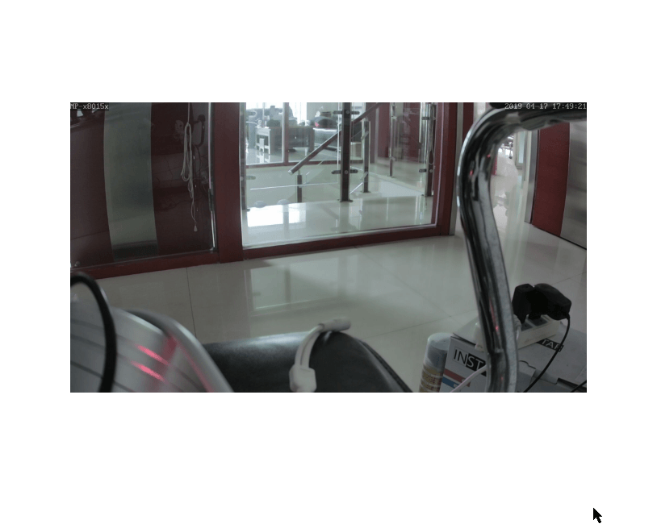

# A little Lightbox

A lightbox for a single image based on jQuery Fancybox and the HTML5 Boilerplate:





## How to use

Just change the image URL:


```html
<div class="flex-box">
    <a href="/fhem/snaps/OfficeCam_snapshot.jpg" data-fancybox data-caption="Latest OfficeCam Snapshot /refreshed every Minute">
        <div class="snapshot-container">
            
        </div>
    </a>
  </div>
```